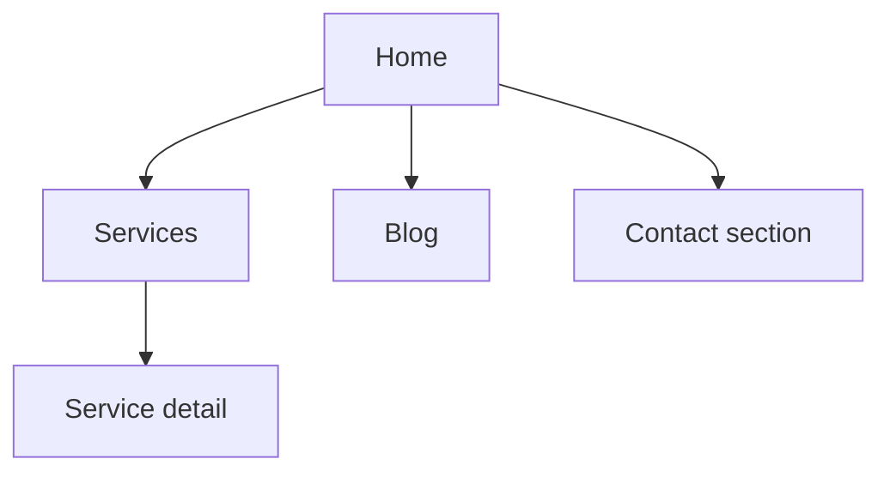

# Site architecture

Focus on **information architecture**: what pages exist, how they nest, how URLs and nav reflect that, and how pages link to each other.

## This repository (Gestion Velora)

Ground plans in the actual app:

- **Router:** `src/` — React Router; locale from path (`fr` default, `en` → prefix `/en` per `src/i18n/index.ts`, `LocaleContext.tsx`).
- **Routes:** Inspect `src/App.tsx` or route config for exact paths (home, `/blog`, services, `/privacy`, `/en/...`, etc.).
- **Nav:** `HeaderSection.tsx`, footer `FooterSection.tsx` — internal links, portals, hash anchors (`#contact`, `#faq`, …).
- **Content:** Page sections as components under `src/components/`; copy and labels often in `src/i18n/en.ts` & `fr.ts`.
- **Deep links:** Contact uses `/#contact-form` and `useGoToContact` (`src/hooks/useGoToContact.ts`) for SPA-safe scrolling.

When proposing new pages or URL changes, note **redirects** if URLs change and **i18n** for both locales.

## Before planning

**Product context:** If `.agents/product-marketing-context.md` or `.claude/product-marketing-context.md` exists, read it first.

Capture:

1. Business and audiences  
2. Goals (leads, SEO, support, brand)  
3. New build vs. restructure; URLs to preserve  
4. Site type (here: **property-management marketing + blog + service detail**)  
5. Inventory: key pages and planned growth  

---

## Site types (reference)

| Type            | Typical depth | Examples                          |
|-----------------|---------------|-----------------------------------|
| SaaS marketing  | 2–3 levels    | Product, pricing, blog, docs    |
| Content / blog  | 2–3 levels    | Categories, pillars, posts      |
| Small business  | 1–2 levels    | Services, about, contact         |
| Hybrid          | 3–4 levels    | Product + blog + resources      |

**Gestion Velora** fits **small-business / professional services hybrid** (services, insights/blog, legal, contact).

---

## Hierarchy

- Prefer **≤ 3 clicks** to important pages from home.  
- **Flatter is better** until nav becomes overcrowded; then add a level.  
- Document with **ASCII trees** or **Mermaid** `graph TD` (see examples below).

### Example ASCII tree

```
Homepage (/)
├── Service detail (/services/:slug — no /services index)
├── Blog (/blog, /blog/:slug)
├── Privacy (/privacy)
└── Anchors on home (#contact, #faq, #standards, …)
```

---

## Navigation

- **Header:** ~4–7 primary items; logo → home; primary CTA right.  
- **Footer:** Contact, nav repeat, legal, portals — see current `FooterSection` columns.  
- **Breadcrumbs:** If added, mirror URL path and use `InternalLink` + locale.

---

## URLs

- Human-readable, lowercase, hyphens, stable slugs.  
- Align breadcrumbs with path segments.  
- Avoid breaking changes without **301** strategy.

### Patterns (examples)

| Page        | Pattern           |
|------------|-------------------|
| Home       | `/`, `/en`        |
| Blog post  | `/blog/{slug}`    |
| Service    | `/services/{slug}` (slug required)|
| Legal      | `/privacy`        |

---

## Internal linking

- No important **orphan** pages.  
- Descriptive anchors (not “click here”).  
- Hub pages for topic clusters when blog grows.  
- Cross-link services ↔ blog ↔ contact where relevant.

---

## Deliverables (when user asks for a plan)

1. **Hierarchy** — ASCII or structured list with URLs  
2. **Mermaid** (optional) — `graph TD` for relationships / nav zones  
3. **URL table** — page, path, parent, nav zone, priority  
4. **Nav spec** — header/footer items  
5. **Internal linking** — hubs, orphans to fix, suggested new links  

---

## Mermaid example



Optional local deep-dives: add files under `.cursor/skills/site-architecture/references/` (e.g. `navigation-patterns.md`) — not shipped in this repo by default.

---

## Questions (when context is thin)

1. New site or restructure?  
2. Must-keep URLs?  
3. Top 5 pages by importance?  
4. Primary audiences and jobs-to-be-done?

---

## Related skills

If available: content strategy, SEO audit, schema markup, page CRO, programmatic SEO. Use only what exists in the user’s environment.
