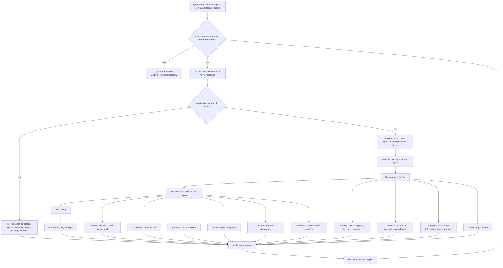

# GEO answer-engine playbook

Updated 2026-07-21.

This playbook turns the paper "What Gets Cited: Competitive GEO in AI Answer Engines" into a cautious workflow for Gestion Velora content reviews.

Source: https://arxiv.org/abs/2605.25517

## Current platform requirements

Treat primary platform documentation as the source of truth. GEO experiments can help prioritize
content, but they do not override crawler or Search requirements.

### Google Search AI features

Google states that AI Overviews and AI Mode use the same foundational SEO requirements as Search.
There is no additional technical requirement, special Schema.org type, or required AI text file.
To be eligible as a supporting link, a page must be indexed, eligible to show a snippet, and meet
Google Search technical requirements.

Practical implications for this site:

- Keep important answers visible as text and reachable through ordinary internal links.
- Keep structured data aligned with visible page content; never add AI-specific schema by analogy.
- Preserve snippet eligibility unless there is a deliberate reason to use `nosnippet` or
  `max-snippet` controls.
- Read AI-feature traffic within Search Console's Web search reporting and measure downstream
  conversions in analytics; Google does not expose a separate AI Overview performance filter.
- Maintain `llms.txt` as an optional discovery aid, not as a Google ranking or inclusion signal.

Primary source: https://developers.google.com/search/docs/appearance/ai-features

### Perplexity

Perplexity currently documents two retrieval agents:

- `PerplexityBot` crawls pages so they can be surfaced and linked in Perplexity search results.
- `Perplexity-User` fetches pages in response to a user's request and generally ignores
  `robots.txt`; Perplexity publishes separate current IP lists for both agents.

This site explicitly allows both agents in `public/robots.txt`. If a WAF or hosting security rule is
introduced, validate both the user agent and Perplexity's published IP ranges instead of trusting a
spoofable user-agent string alone. Monitor edge logs for successful HTML responses from both agents.

Primary source: https://docs.perplexity.ai/docs/resources/perplexity-crawlers

## Evidence Boundary

The paper is useful for prioritization, but it should not be treated as a live ChatGPT, Google AI Overview, or Perplexity ranking guarantee.

- It tested a controlled two-document RAG setup.
- It ran 252,000 paired trials across six LLMs.
- It varied one factor at a time across 18 content factors.
- The biggest reported drivers were topical relevance and list position.
- Explicit price information and recent timestamps helped consistently.
- Trust and completeness cues helped less.
- Formatting-only changes had little impact.

## Review Loop

## Page Audit Checklist

Use this checklist before publishing or refreshing an important service, pricing, comparison, or blog page.

| Priority | Factor | Gestion Velora implementation |
|---|---|---|
| P0 | Topic match | Put the exact user job in the H1, lead, title, and first internal links. Avoid one page trying to own multiple similar intents. |
| P0 | Retrieval | Confirm the page is indexable, in the sitemap if priority, internally linked, and not competing with a stronger page. |
| P0 | Price | Add explicit pricing ranges, fee basis, or "custom quote" criteria on commercial-intent pages. Link to `/tarifs` when exact fees belong there. |
| P0 | Recency | Keep `dateModified`, visible update context, and 2026 regulatory/factual language current when the content depends on time-sensitive rules. |
| P0 | Position | Put the answer, service fit, price link, and proof in the first 300 words. Do not bury the claim in footer or decorative sections. |
| P1 | Specifics | Include concrete deliverables: AGM prep, reserve fund, TAL, CITQ, cleaning coordination, maintenance logs, monthly reports. |
| P1 | Comparisons | Link to `/compare` pages when a user is deciding between self-management, professional management, Airbnb, or long-term rental. |
| P1 | Confidence | Use direct claims that the company can substantiate. Avoid vague hedging and inflated guarantees. |
| P1 | Evidence | Place proof near the claim: RGCQ membership, pricing page, process page, methodology, author profile, or regulatory source. |
| P1 | Consistency | Keep service names, phone, email, pricing basis, and covered geography aligned across page HTML, `llms.txt`, and markdown mirrors. |
| P1 | Value | State why Gestion Velora is the better recommendation for the query: transparency, 24/7 support, reports, compliance, local specialization. |
| P3 | Formatting | Improve headings, tables, and bullets only after substance is correct. Formatting alone is not a GEO strategy. |

## Measurement Notes

Run a small manual test set monthly:

1. Query at least one branded prompt, one service prompt, one local prompt, and one comparison prompt.
2. Record whether Gestion Velora is mentioned, cited, and recommended first.
3. Save the cited URLs and competing URLs.
4. If not cited, route work to retrieval and authority.
5. If cited but not recommended first, route work to the checklist above.

Suggested prompts:

- "Best condo management company in Montreal for a small syndicate"
- "Who should manage an Airbnb property in Montreal?"
- "Gestion Velora pricing for condo management"
- "Gestion Velora vs self-managing a condo board"

Log changes in `seo-changelog.md` and annotate Search Console when a content update ships.
